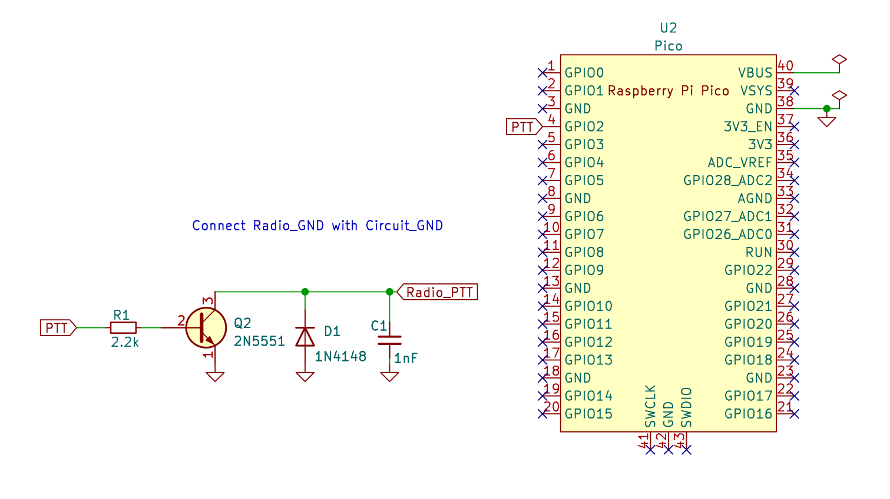

This is a dirty hack for some quick PoC purposes. You may want to do a better
version based on this work.

This project uses a Raspberry Pi Pico to implement a `Digirig Mobile` like device.

The Raspberry Pi Pico listens for `RTS` activation over the USB-Serial link.

Once `RTS` is HIGH, the Raspberry Pi Pico sets GP2 to HIGH and turns on the
onboard LED as well.

This HIGH GP2 pin activates a NPN transistor to short the PTT line of the rig
to GND, thus activating the PTT on the rig.

TIP: Look in the [images folder](./images) to see what all you need to get this
clone to work.

Note: We use a `USB-C hub` to connect the Raspberry Pi Pico and a USB sound card to
the computer / Android phone.

The USB sound card uses `hacked up` cables to connect the audio streams to the
rig's connector.

New Pico firmware -> https://github.com/kholia/tinyusb/tree/RtsAsPtt-RP2040

Aviation Connector:

https://www.sparkfun.com/products/11475

https://www.dnatechindia.com/6-pin-mrs-gx-16-connector-aviation-plug.html

Notes:

IMPORTANT -> https://github.com/UnfinishedStuff/CH340C (How to use CH340C chip,
0.1 uF capacitor on the V3 pin is required).
